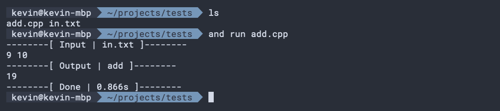
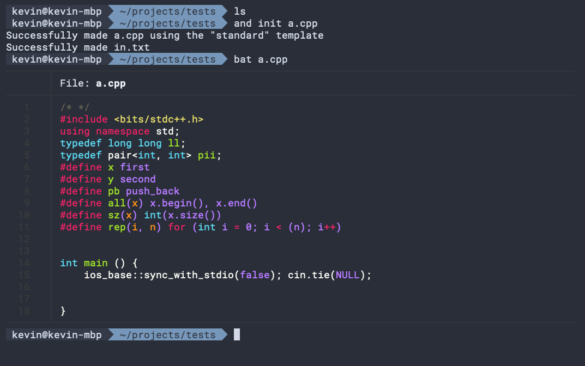

# And Run
And Run is a command line tool that helps you code faster in competitive programming contests. It gives you the ability to quickly run and compare your code against test cases, as well as many useful tools for contest management.

> And Run is a tool designed specifically for my personal workflow in competitive programming contest. It is still under development.

## Features
__Compile and run code__, and display runtime statistics in one neat package! No more fiddling with annoying compile flags, or switching between input and output tags.

__Quickly check your code__ against a series of test cases with one command. Great when you need to do a quick check for a bunch of cases before submitting.

__Initialise code files from templates__, meaning you can dive straight into coding without the hassle of defining all your macros first.

__And much more!__ For a full list of features and usage instructions, see `docs/README.md`

## Upcoming features
- Faster Debugging
    - Tools to help find discrepant outputs based on a brute force solution and a random input generator
    - Tools to help find incorrect inputs based on a checker algorithm and a random input generator
- Generating Contest Workspaces
    - Easier navigation of problems

And Run was developed by Kevin Zhu in Python3 using the Click library. 
