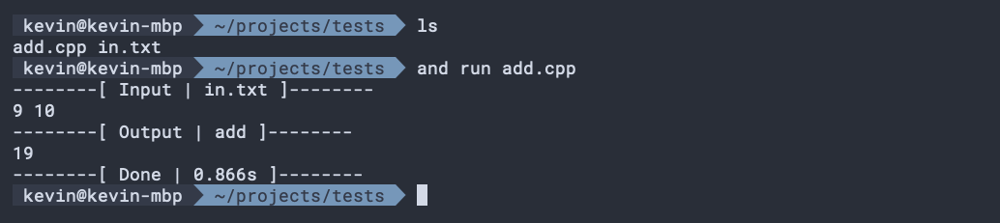
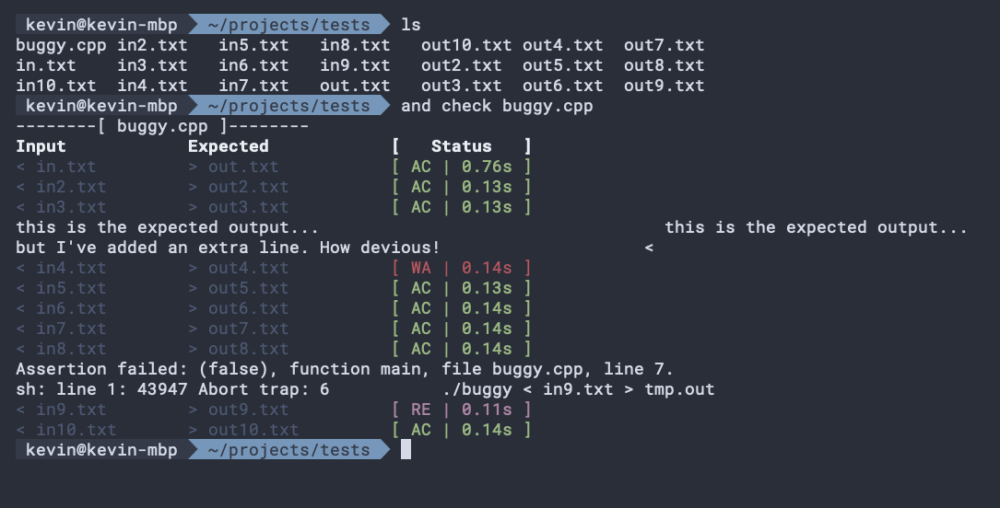

# Command Usages

## Compiling and Running Code
### `and run`
```sh
and run add.cpp
```
Compiles and runs your code on the most likely input file (typically "in.txt") in the current directory. 
When it runs, it will print the head of the input file and the output, and give useful statistics such as the time it took for the program to run.
Just like Makefiles, it will only recompile your code if it detects that it has changed since the last time you have compiled the code. 

If the cpp file name is not specified, it will automatically find the first cpp file alphabetically in the directory to compile.

It supports the following flags

- `-i <filename>` - Specify a new input file.
- `-f`, `--force` - Force compilation.
- `-q`, `--quiet` - Run the code without printing out input and time taken.

The compilation flags can be modified from `config.py` (see `and config`).



### `and compile`
```sh
and compile add.cpp
```
Compiles the code without running it. Just like `and run`, it will not recompile code if it is not necessary. This behaviour can be overridden with `-f`.

If the cpp file name is not specified, it will automatically find the first cpp file alphabetically in the directory to compile.

### `and check`
```sh
and check add.cpp
```
Compiles and runs the code against all input files in the current directory that have a corresponding expected output file. For each one, it will display a colored input saying whether the program matches the expected output (AC), didn't match (WA) or crashed (RE). In the case of WA, it will display the difference between the two outputs.

If the cpp file name is not specified, it will automatically find the first cpp file alphabetically in the directory to compile.



_Note: The expected output filename is obtained by getting the input file and replacing the `input_key` with the `expected_key`, which are defined in `config.py` (see `and config`). By default, `input_key` is "in" and `expected_key` is "out"_ 

## Contest Management
### `and init`
```sh
and init a.cpp
```
Creates a new code file, as well as a corresponding input file called `in.txt` in the current directory. You can use flags to choose between several templates. If it detects that the code file has been modified since it has been initialised (or is empty), then it will refuse to overwrite the file. Otherwise, you can change between any of the base templates.

The template options are:

- no flag, standard - Empty main function with macros defined.
- `-l`, `--light` - Empty main function, no macros defined.
- `-c`, `--cases` - Main function setup to run multiple cases, macros defined.


### `and contest`
```sh
and contest [A-Z]
```
Generates folders from A to the specified letter. Also generates a `notes.md` file that contains the current time, used for timekeeping purposes.

## Tool Management
```sh
and config
```
Opens the config file `config/config.py` for modification. Here you can change multiple default variables that define how the CLI tool works. See the file for documentaiton on each of the fields.
